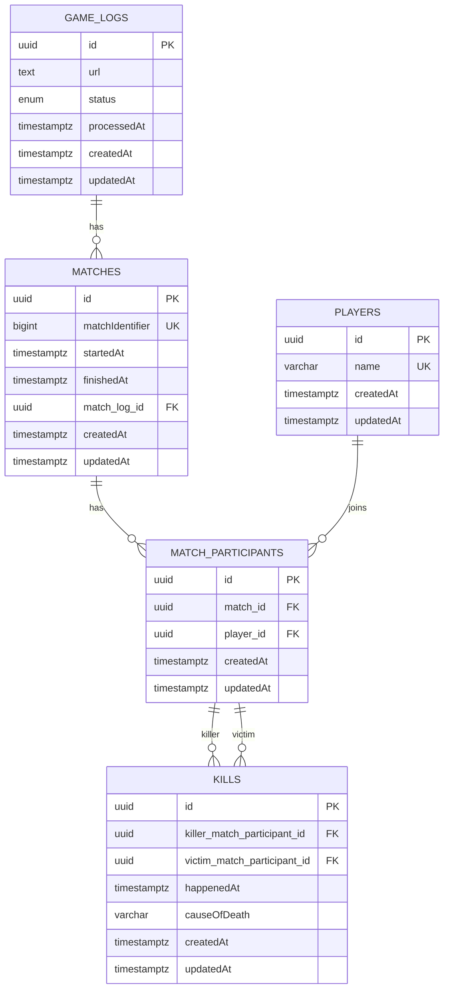

## Como rodar a aplicação

### Pré-requisitos

- docker
- docker-compose
- python (apenas para a ferramenta log_gen)

### Como iniciar o servidor

- Execute `docker compose up --build` para construir e iniciar os contêineres.

#### Gerador de Logs

Foi implementado um script em Python para geração de arquivos de log. O script recebe dois parâmetros, sendo o primeiro o número de partidas a serem geradas, e o segundo sendo a média de mortes por partida (utilizando uma distribuição normal). O script pode ser executado assim:

```bash
python log_gen.py 1000 50
```

Será produzido um arquivo game_log.txt que pode ser usado para fazer upload na aplicação.

### Acessando os endpoints da aplicação

Arquivos de log podem ser enviados visitando [`GET /`](http://localhost:3000/)
<details>
  <summary><i>Exemplo:</i></summary>
  
</details>

Para visualizar as estatísticas de uma partida específica, basta visitar [`GET /matches/ID_AQUI`](http://localhost:3000/matches/123)
<details>
  <summary><i>Exemplo:</i></summary>
  
</details>

Para visualizar estatísticas globais de todas as partidas já registradas, basta visitar [`GET /matches/`](http://localhost:3000/matches/)
<details>
  <summary><i>Exemplo:</i></summary>
  
</details>


---

## Visão Geral

Este projeto implementa o desafio técnico de análise dos arquivos de log de um jogo de tiro. A solução foi pensada como um pipeline **escalável de ingestão e análise** desses arquivos de logs.

O sistema é capaz de processar arquivos de log contendo múltiplas partidas, extrai dados estruturados (jogadores, participantes, mortes, partidas) e os persiste em um banco de dados relacional para consultas e análises posteriores.

Foi projetado para lidar com **logs possivelmente grandes** (dezenas ou centenas de milhões de
mortes por arquivo de log) de forma eficiente, utilizando:

- Streams para leitura e escrita de arquivos sem carregá-los completamente em memória.
- Divisão dos logs em arquivos menores (um por partida).
- Um sistema de filas de **dois níveis** com BullMQ para escalabilidade e tolerância a falhas.

---

## Arquitetura

Como mencionado anteriormente, a arquitetura é baseada em um pipeline e possui quatro etapas principais:

1. **Etapa de Ingestão**
   - Usa o `GameLogParser` para ler arquivos de log linha por linha usando streams.
   - Divide o log em chunks, um arquivo por partida, e os escreve no disco também usando streams.
   - Enfileira jobs na fila `match-logs` para processar cada partida individualmente.

2. **Etapa de Transformação dos dados**
   - O `MatchLogParser` lê arquivos de partidas individuais como um stream.
   - Extrai informações sobre participantes e mortes.
   - Envia os resultados estruturados para o `MatchService`.

3. **Etapa de Persistência**
   - Entidades modeladas com TypeORM: `Match`, `Player`, `MatchParticipant` e `Kill`.
   - Transações garantem ingestão idempotente (segura para retries).
   - Inserções em bulk garantem mais eficiência e menos sobrecarga na conexão com o banco de dados.

4. **Etapa de Análise**
   - O `AnalysisService` serve como uma interface amigável para as análises que o sistema oferece.
   - Todas as análises foram implementadas em queries SQL visando maior performance.
   - Estão disponíveis as seguintes análises: `GlobalLeaderboard`, `MatchLeaderboard`,
     `MatchFragStreaks`, `MatchNoDeath` e `MatchSpeedKillers`

---

### Sistema de Filas em Dois Níveis

Foi utilizado **BullMQ** com duas filas:

- **Fila `game-logs`**
  Responsável por jobs de grandes arquivos de log.
  Cada job:
  - Executa o `GameLogParser` para dividir o arquivo em partidas.
  - Enfileira novos jobs na fila `match-logs` (um por partida).

- **Fila `match-logs`**
  Responsável por jobs de partidas individuais.
  Cada job:
  - Executa o `MatchLogParser` para analisar o arquivo da partida.
  - Persiste os dados no banco via `MatchService`.

#### Benefícios
- **Escalabilidade**: Um único log se divide em múltiplos jobs de partidas processados em paralelo.
- **Isolamento de falhas**: Uma falha ao processar uma partida não afeta as demais.
- **Retries**: Pode ser adicionada alguma estratégia para retries, caso necessário.

Um tempo atrás, escrevi sobre esse tipo de solução [neste post](https://medium.com/@luizrogeriocn/improving-rails-scalability-with-better-architecture-c102a2a0cdec) 👴

---

### Streams para uso eficiente da memória

O sistema usa **streams do Node.js** para processar os logs linha a linha:

- **Memória**: O arquivo nunca é carregado inteiro na RAM. Mesmo logs muito grandes podem ser processados.
- **Saída em chunks**: Cada partida é gravada diretamente em arquivo próprio via stream.
- **Extensível**: Essa mesma lógica pode ser adaptada para consumir logs via outros tipos de streams.

Ou seja, o pipeline é  **agnóstico** sobre origem dos dados, o que facilita a adoção de outras fontes de
informação, caso seja necessário.

---

### Entidades

Diagrama ER das entidades principais:



#### GameLog

Entidade criada, principalmente, para guardar uma referência para o arquivo de log a ser processado que fica no atributo `url`. Em ambiente de desenvolvimento é utilizado o `LocalStorageService`, que guarda esses arquivos localmente. Mas foi criada uma interface de `storage` numa tentativa de tornar simples a adoção de outras implementações para armazenamento como Amazon S3.

Inicialmente havia a ideia de possibilitar a gestão desses uploads, por isso foram criados os atributos `status` e `processedAt`, mas o suporte à essa funcionalidade não chegou a ser implementado.

#### Players

Funciona como uma tabela global de jogadores evitando que haja duplicação desses registros (foram assumidos como únicos pelo nome).

#### Match

Essa entidade representa uma partida do jogo de tiro que foi processada pela etapa de ingestão. Possui um identificador externo que foi chamado de `matchId` e os horários de início e término da partida `startedAt` e `finishedAt`. Foi criado também um campo para relacionamento com o `GameLog` que pode utilizado para fins de depuração em casos de problemas, mas isso não foi implementado. Inclusive, durante a ingestão temos acompanhamento de quais linhas no arquivo original são referentes a cada partida e poderíamos também salvar essas informações se fosse necessário.


#### MatchParticipant

Essa entidade representa a participação de um jogador em uma partida (`Player`, `Match`). Além disso ela é importante para que possamos fazer o relacionamento mais importante da aplicação: a participação dos jogadores nos eventos de morte das partidas.


#### Kill

A entidade que modela os eventos de morte das partidas. Ela se relaciona com `MatchParticipant` tanto como `killer` quanto como `victim`, permitindo saber quem matou quem. Também armazena a causa da morte `causeOfDeath` e o momento em que aconteceu `happenedAt`. É importante observar que `killer` pode ser nulo, representando uma morte efetuada pelo mundo.

---

## Organização do Projeto

Representação de como os diretórios e arquivos da aplicação estão organizados:

```
src
├── app.module.ts              # Módulo raiz da aplicação
├── main.ts                    # Ponto de entrada da aplicação
├── match-domain               # Módulo de domínio para funcionalidades das partidas
│   ├── analysis               # Lógica de negócio para análise de resultados das partidas
│   │   ├── global-leaderboard.analysis.ts
│   │   ├── match-frag-streaks.analysis.ts
│   │   ├── match-leaderboard.analysis.ts
│   │   ├── match-no-death.analysis.ts
│   │   ├── match-speed-killers.analysis.ts
│   │   └── match-winner.analysis.ts
│   ├── controllers             # endpoints HTTP
│   │   ├── match.controller.spec.ts
│   │   └── match.controller.ts
│   ├── entities                # Entidades TypeORM que representam tabelas do banco de dados
│   │   ├── game-log.entity.ts
│   │   ├── kill.entity.ts
│   │   ├── match-participant.entity.ts
│   │   ├── match.entity.ts
│   │   └── player.entity.ts
│   ├── ingestion               # Parsing e ingestão de arquivos de log
│   │   ├── game-log-parser.spec.ts
│   │   ├── game-log-parser.ts
│   │   ├── match-log-parser.spec.ts
│   │   └── match-log-parser.ts
│   ├── match-domain.module.ts  # Declaração do módulo de domínio
│   ├── services                # Serviços da aplicação
│   │   ├── analysis.service.ts
│   │   ├── game-log.service.ts
│   │   ├── ingestion.service.ts
│   │   └── match.service.ts
│   └── workers                 # Workers em background (BullMQ)
│       ├── game-logs.processor.ts
│       └── match-logs.processor.ts
```

---

### Testes

Existem alguns testes unitários para os parsers (`GameLogParser`, `MatchLogParser`) e um teste de "integração entre eles.

Eu planejava escrever a maior parte dos testes em cima das análises das partidas, que considerei como a principal funcionalidade do projeto. Porém tive muita dificuldade em fazer um banco de dados funcionar de maneira apropriada no ambiente de testes. Investi bastante tempo na tentativa de fazer isso funcionar (adicionar Docker foi uma das tentativas de verificar se o problema era na minha instalação de postgres local). Em determinado momento, consegui ter um banco rodando no ambiente de testes e que fazia rollback das mudanças ao fim da cada teste (`afterEach`) mas por algum motivo não consegui reproduzir esse comportamento consistentemente.

Ainda cogitei tentar fazer mock da conexão com o banco, porém percebi que não ajudaria muito visto que as análises foram todas implementadas diretamente com SQL. Assim estaríamos mockando justamente o sujeito a ser testado.

Então resolvi continuar iterando nos desafios para pelo menos entregar todas as outras coisas que foram pedidas.

---

### Friendly Fire

Essa funcionalidade foi modelada mas não chegou a ser implementada. A ideia seria ter um log ligeiramente modifiacado, da seguinte maneira:

```bash
24/04/2020 16:14:22 - New match 11348961 has started
24/04/2020 16:14:22 - Roman joined <TEAM RED>
24/04/2020 16:14:22 - Marcus joined <TEAM BLUE>
24/04/2020 16:14:22 - Jhon joined <TEAM RED>
24/04/2020 16:14:22 - Bryian joined <TEAM RED>
24/04/2020 16:26:12 - Roman killed Marcus using M16
24/04/2020 16:35:56 - Marcus killed Jhon using AK47
24/04/2020 17:12:34 - Roman killed Bryian using M16
24/04/2020 18:26:14 - Bryan killed Marcus using AK47
24/04/2020 19:36:33 - <WORLD> killed Marcus by DROWN
24/04/2020 20:19:22 - Match 11348961 has ended
```

De forma que entre o início do jogo e o primeiro evento de morte, estariam todos os eventos em que os jogadores entram nos times.

Então adicionaríamos um atributo `team`, do tipo `string`, em `MatchParticipant` no qual guardaríamos essa informação. Seria necessário modificar o `MatchLogParser` com uma nova regex pra capturar essas linhas e então acumulá-las de forma que seja passado pra o `MatchService` salvar no banco ao executar a função `importMatch`.

---

### Performance

Foram efetuados testes de importação com logs contendo algumas dezenas de milhões de mortes, e o sistema se comportou bem. Continuou responsivo, uma vez que a carga estava toda nos background jobs, e a página de estatísticas dos jogos continuou sendo calculada sem atraso.

Nesse cenário, porém, a página das estatísticas globais demorava cerca de 5 segundos para ser calculada. O que já deixa de ser aceitável.

#### Materialized Views

Uma das opções para contornar essa degradação de performance, seria ter uma view materializada na qual guardaríamos essas informações já calculadas. E poderíamos definir um intervalo de tempo para atualização da view, tendo um cron-job para realizar essa tarefa. 

#### Exemplo

<details>
  <summary><i>Tempo para o cálculo em uma base com pouco mais de 700.000 `kills` (0.7 segundos):</i></summary>
  
</details>


---

### Logging

Utilizei `console.log` para alguns logs da aplicação. Seria interessante melhorar isso com a introdução de uma biblioteca especializada em logs estruturados. Numa pesquisa rápida, encontrei uma ferramenta chamada `Winston` que poderia ser utilizada.

---

### Notas Pessoais :)

Primeiramente, gostaria de agradecer a oportunidade de participar desse desafio!

Foi bem interessante e precisei aprender muita coisa nova, uma vez que não tinha familiaridade com o
ferramental de Node, TypeScript/JavaScript.

Minha experiência é majoritariamente em Ruby e Elixir, então é possível (ou provável) que o código
não esteja tão idiomático. Mas acredito que a maioria dos conceitos que tentei utilizar sejam
intercambiáveis pra qualquer stack.

Acabei tendo bem mais dificuldade do que eu esperava com a parte de garantir uma conexão com o banco
de dados, especialmente para os testes. Mas imagino que seja apenas devido à falta de familiaridade
com a forma de fazer isso em aplicações que utilizam as bibliotecas requeridas pelo desafio.

No mais, tentei modelar uma solução eficiente e escalável mas que mantivesse a simplicidade,
facilidade de manutenção e de extensão.

👋
