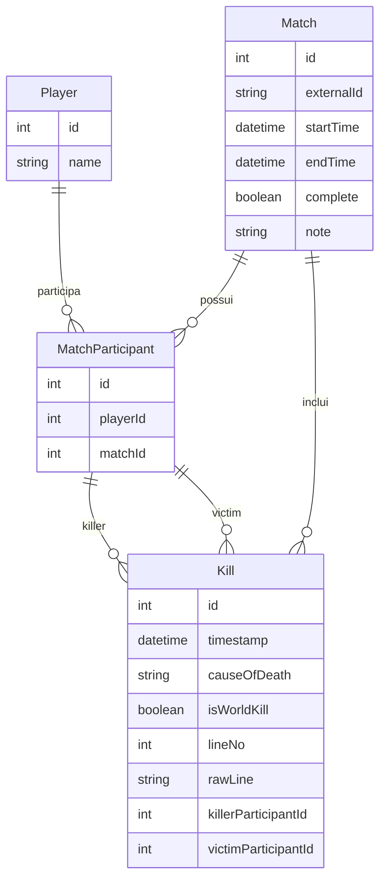

# Ingestão e Análise de Logs de Partidas

## 📖 Visão Geral

Este projeto implementa um pipeline **escalável de ingestão e análise** para arquivos de logs de jogos.  
Ele processa grandes arquivos de log contendo múltiplas partidas, extrai dados estruturados (jogadores, participantes, mortes, partidas) e persiste em um banco de dados relacional para consultas e análises posteriores.

O sistema foi projetado para lidar com **logs possivelmente grandes** de forma eficiente, utilizando:

- Streams para leitura de arquivos sem carregá-los completamente em memória.
- Divisão dos logs em arquivos menores (um por partida).
- Um sistema de filas de **dois níveis** com BullMQ para escalabilidade e tolerância a falhas.

---

## 🏗️ Arquitetura

A arquitetura possui quatro camadas principais:

1. **Camada de Ingestão**  
   - Usa o `MatchLogStreamer` para ler arquivos de log linha por linha.  
   - Divide o log em chunks (um arquivo por partida).  
   - Enfileira jobs na fila `match-logs` para cada partida.

2. **Camada de transformação dos dados**  
   - O `MatchLogConsumer` analisa arquivos de partidas individuais e extrai participantes, mortes e timestamps.  
   - Envia os resultados estruturados para o `MatchService`.

3. **Camada de Persistência**  
   - Entidades modeladas com TypeORM: `Match`, `Player`, `MatchParticipant` e `Kill`.  
   - Transações garantem ingestão idempotente (segura para retries). [TO-DO] 
   - A tabela global `Player` evita duplicação de identidades de jogadores entre partidas.

4. **Camada de Análise**  
   - O `AnalysisService` calcula placares de cada partida (kills e deaths por jogador), ranking
     global e armas favoritas.
   - Extensões futuras: maior sequencia de frags e awards. [TO-DO]

---

## ⚙️ Sistema de Filas em Dois Níveis

Foi utilizado **BullMQ** com duas filas:

- **Fila `game-logs`**  
  Responsável por jobs de grandes arquivos de log.  
  Cada job:
  - Executa o `MatchLogStreamer` para dividir o arquivo em partidas.  
  - Enfileira novos jobs na fila `match-logs` (um por partida).

- **Fila `match-logs`**  
  Responsável por jobs de partidas individuais.  
  Cada job:
  - Executa o `MatchChunkConsumer` para analisar o arquivo da partida.  
  - Persiste os dados no banco via `MatchService`.

### Benefícios
- **Escalabilidade**: Um único log se divide em múltiplos jobs de partidas processados em paralelo.  
- **Isolamento de falhas**: Uma falha ao processar uma partida não afeta as demais.  
- **Retries**: Apenas jobs que falharem são reprocessados. [TO-DO retries ainda nao foram configurados]

---

## 📉 Uso de Streams para Eficiência

O sistema usa **streams do Node.js** (`fs.ReadStream` e `readline.Interface`) para processar os logs linha a linha:

- **Memória eficiente**: O arquivo nunca é carregado inteiro na RAM. Mesmo logs muito grandes podem ser processados.  
- **Saída em chunks**: Cada partida é gravada diretamente em arquivo próprio via `fs.WriteStream`.  
- **Extensível**: Essa mesma lógica pode ser adaptada para consumir logs via outros tipos de streams.

Isso torna o pipeline **agnóstico da origem dos dados**: hoje arquivos, amanhã fluxo em tempo real.

---

## 🗃️ Entidades

Diagrama ER das entidades principais:

```mermaid
erDiagram
    Player ||--o{ MatchParticipant : participa
    Match ||--o{ MatchParticipant : possui
    Match ||--o{ Kill : inclui
    MatchParticipant ||--o{ Kill : killer
    MatchParticipant ||--o{ Kill : victim

    Player {
      int id
      string name
    }

    Match {
      int id
      string externalId
      datetime startTime
      datetime endTime
      boolean complete
      string note
    }

    MatchParticipant {
      int id
      int playerId
      int matchId
    }

    Kill {
      int id
      datetime timestamp
      string causeOfDeath
      boolean isWorldKill
      int lineNo
      string rawLine
      int killerParticipantId
      int victimParticipantId
    }
```

